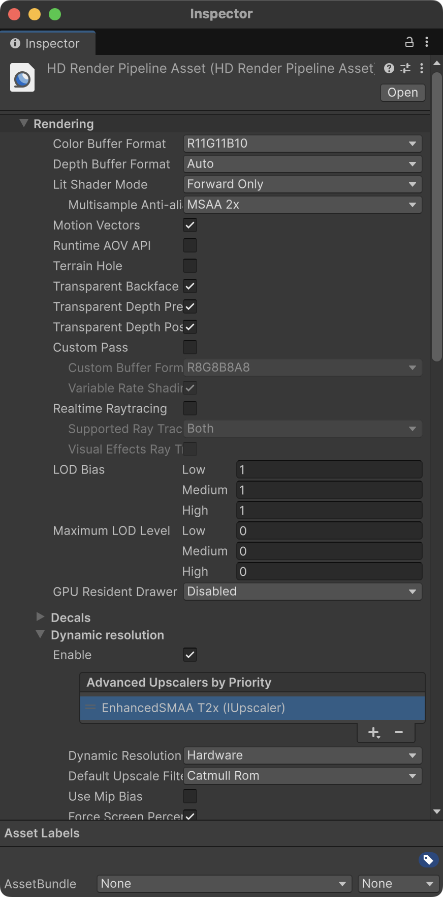
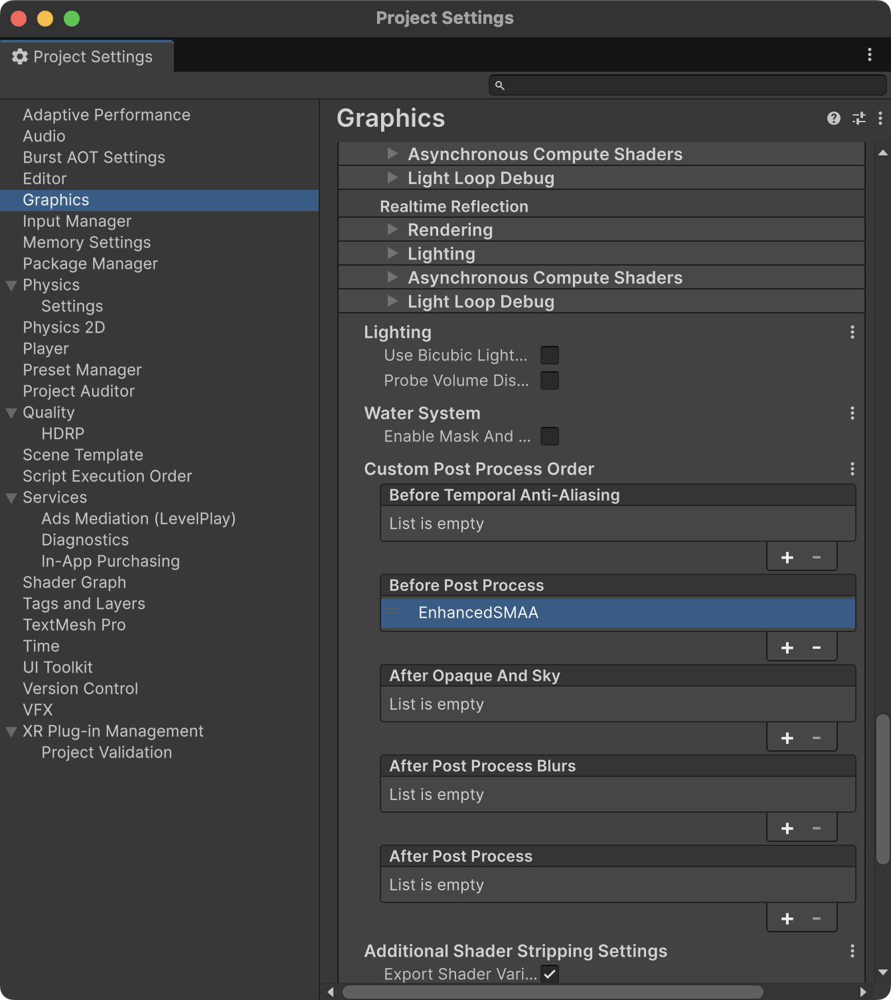

# [WIP] SMAA: Enhanced Subpixel Morphological Antialiasing for Unity HDRP

A Unity HDRP port of the original Subpixel Morphological Antialiasing (SMAA) algorithm.

## ⚙️ Configure

Apply the following project settings to activate SMAA T2x:

<table>
  <tr>
    <td><b>HDRP Asset Settings</b></td>
    <td><b>Project Graphics Settings</b></td>
  </tr>
  <tr>
    <td valign="top"></td>
    <td valign="top"></td>
  </tr>
</table>

## 📚 References
- **Original Source:** https://github.com/iryoku/smaa
- **Research Page:** https://www.iryoku.com/smaa/
